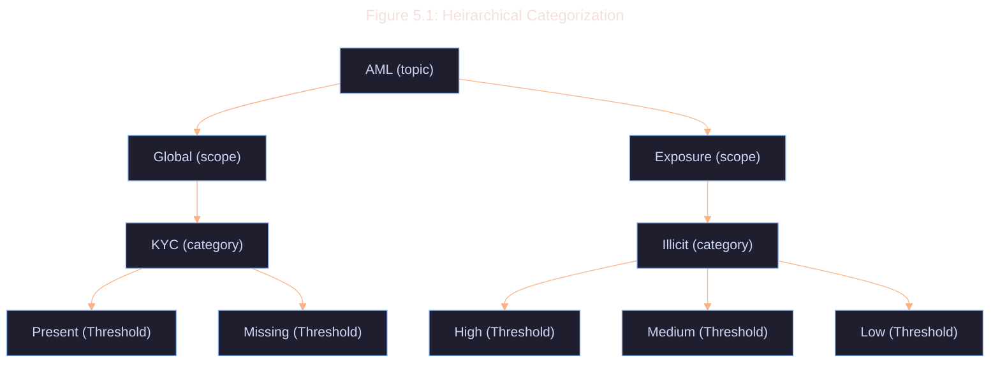

# 5.4 Categorization Best Practices

1. **Hierarchical Categories**: Organize categories in a hierarchical structure for more nuanced classification.

2. **Multi-Label Classification**: Allow records to belong to multiple categories simultaneously.

3. **Threshold Scores**: Include threshold scores for each category assignment.

4. **Interpretability**: Explain category assignments.

5. **Cross-Protocol Consistency**: Ensure consistent categorization across different protocols for similar state transitions.

6. **Version Control**: Maintain version control for classification rule-set and category definitions.

7. **Auditability**: Implement logging mechanisms to track the reasoning behind each categorization decision.

8. **Privacy-Preserving Classification**: Consider using homomorphic encryption or secure multi-party computation for privacy-sensitive features.

9. **Efficient Querying**: Design category to record mapping to allow for efficient querying of records based on category criteria.
