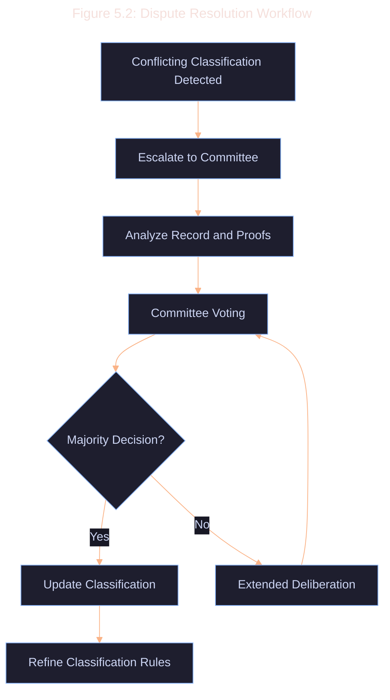

# 5.6 Classification Dispute Resolution

In cases where multiple feature extractors or classification rules lead to conflicting categorizations, a dispute resolution process is necessary.

### Dispute Resolution Process

1. **Detection**: Automated systems identify conflicting classifications for the same record.

2. **Escalation**: Disputes are escalated to a resolution committee.

3. **Analysis**: The committee examines:

   - Raw record data
   - Extracted features from each extractor
   - Applied classification rules
   - Verifiable Classification proofs

4. **Voting**: Committee members vote on the correct classification.

5. **Resolution**: The majority decision is applied, and the record's classification is updated.

6. **Rule Refinement**: If necessary, classification rules are updated to prevent similar future disputes.

### Best Practices for Dispute Resolution

1. **Diverse Committee**: Ensure the resolution committee includes members with varied expertise (e.g., protocol developers, cryptographers, domain experts).

2. **Transparent Process**: Document and make public the dispute resolution process and outcomes.

3. **Timeboxed Resolution**: Set strict timeframes for each stage of the dispute resolution process.

4. **Weighted Voting**: Consider implementing a weighted voting system based on member expertise or stake.

5. **Appeal Mechanism**: Allow for appeals of dispute resolutions under specific circumstances.

6. **Incentive Alignment**: Implement a reward/penalty system for committee members based on the accuracy of their votes.
