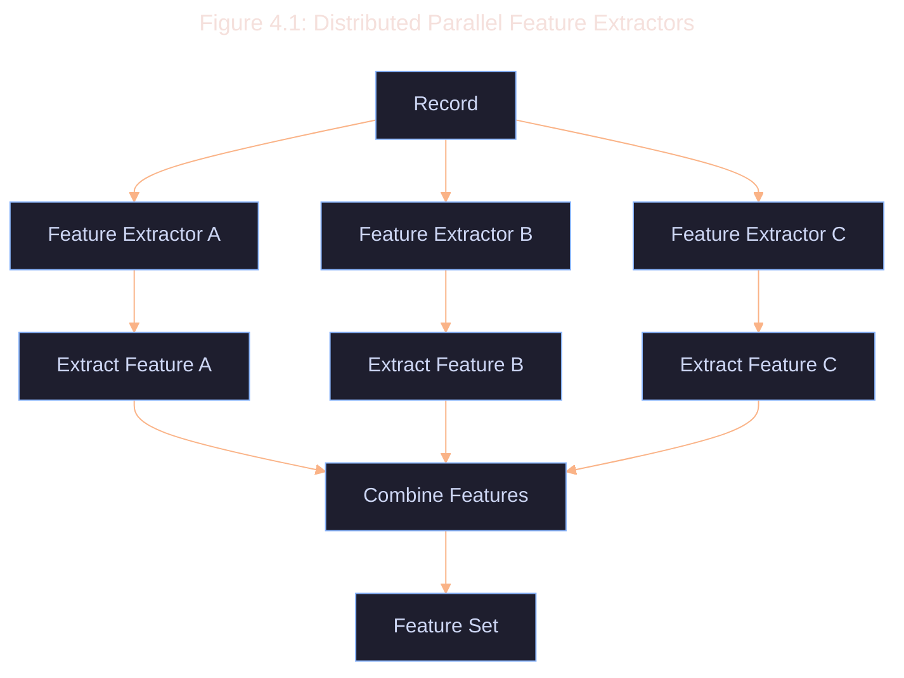

# 4.4 Performance Considerations

Feature extraction can be computationally intensive and difficult to scale.
Optimization strategies have been considered to ensure that feature extraction is efficient and scalable.

1. **Parallel Processing**: Parallel & distributed feature extraction for independent features.

2. **Caching**: Caching of intermediate results for frequently accessed data.

3. **Optimized Data Structures**: Optimise schemas to allow efficient data structures for feature representation and manipulation.

4. **Batched Processing**: Process multiple records in batches to amortize overhead costs.

5. **Feature Selection**: Features selected carefully to provide the most discriminative power for downstream tasks.

Performance can be quantified using the following metrics:

1. **Extraction Throughput**
2. **Feature Extraction Latency**
3. **Memory Efficiency**
