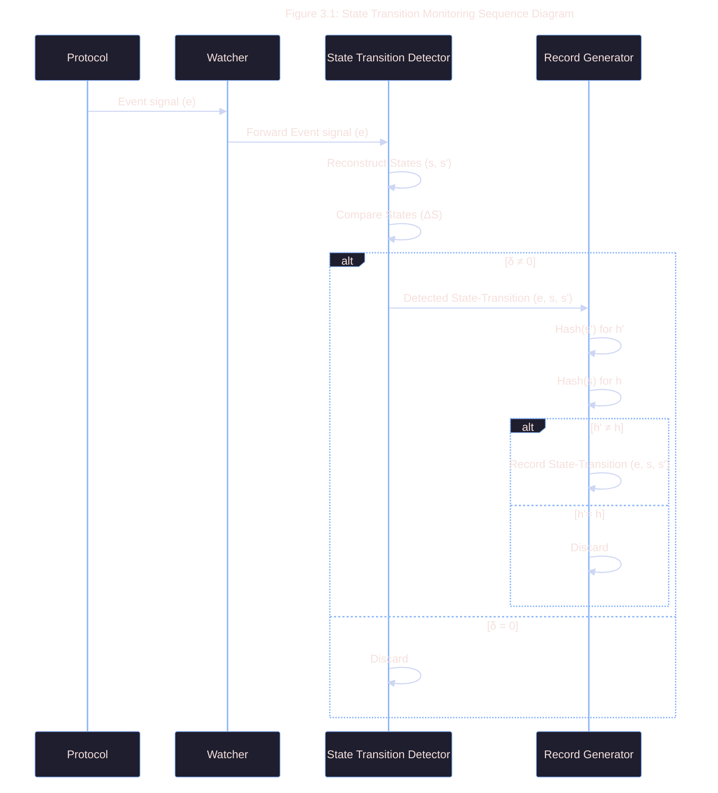

# 3.2 State Transition Monitoring

```admonish note Title="How to Register"
To register a protocol, please view the steps
outlined in the ["For Onchain Protocols"](/path_to_integration/protocols/1_how_to_register.md) section.
```

State transition monitoring involves observing the blockchain for relevant events
and state changes in integrated protocols.



The process follows these steps:

1. **Protocol Registration**: Protocols are registered with the ASP system, providing their $Scope$ function and event signatures.

2. **Event Listening**: The Watcher subscribes to signals (event emission) from registered protocols that indicates a state change
   and forwards the event signal $e$ to the State Transition Detector.

3. **State Reconstruction**:

   ```admonish important

   It is expensive & inefficient for the Observer to reconstruct or store the entire state of the protocol.

   $s$ and $s'$ are only state representations / proofs which carry enough information to verify a state-transition with
   comparator function $\Delta S$.

   **For example**: $s$ could be a merkle-proof of a state-root, and $s'$ could be the new state-root.
   ```

   With a well-defined state-space $S$ and state transition-function $T$, $s$ and/or $s'$ is reconstructed from
   data carried by $e$ and the cached pre-image read from the state-buffer.

4. **State Comparison**: The $\Delta S$ function is applied to determine if a meaningful state transition has occurred:

   $$\delta = \Delta S(s, s')$$
   Where $\delta \neq 0$ indicates a state transition.

5. **Trigger Record Generation**: Tuple $(e, s, s')$ is sent to the Record Generator to compose a cryptographic record of the state transition if $\delta \neq 0$.

6. **Record Generation**: The Record Generator hashes the new state $s'$ and the previous state $s$ to create a record of the state transition:

   $$R = (Scope, e, h, h')$$

   Where $h$ and $h'$ are the hashes of the previous and new states and $h \neq h'$.
