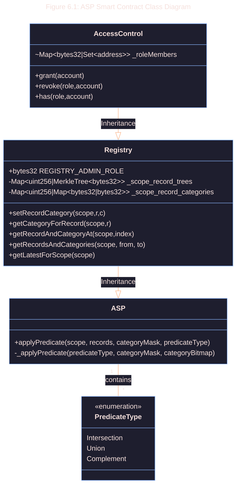

# 6.1 Smart Contract Specification

```admonish info
The Public Registry is a collection of smart contracts which serves as the on-chain storage solution for the ASP.
It provides the necessary interfaces for onchain protocols to integrate with the ASP.
```

The current [registry](https://github.com/0xbow-io/asp-contracts-V1.0) is composed of 2 core contracts:

- **Record Category Registry** ([view contract](https://github.com/0xbow-io/asp-contracts-V1.0/blob/main/src/RecordCategoryRegistry.sol))
- **Association Set Provider** ([view contract](https://github.com/0xbow-io/asp-contracts-V1.0/blob/main/src/RecordCategoryRegistry.sol))


